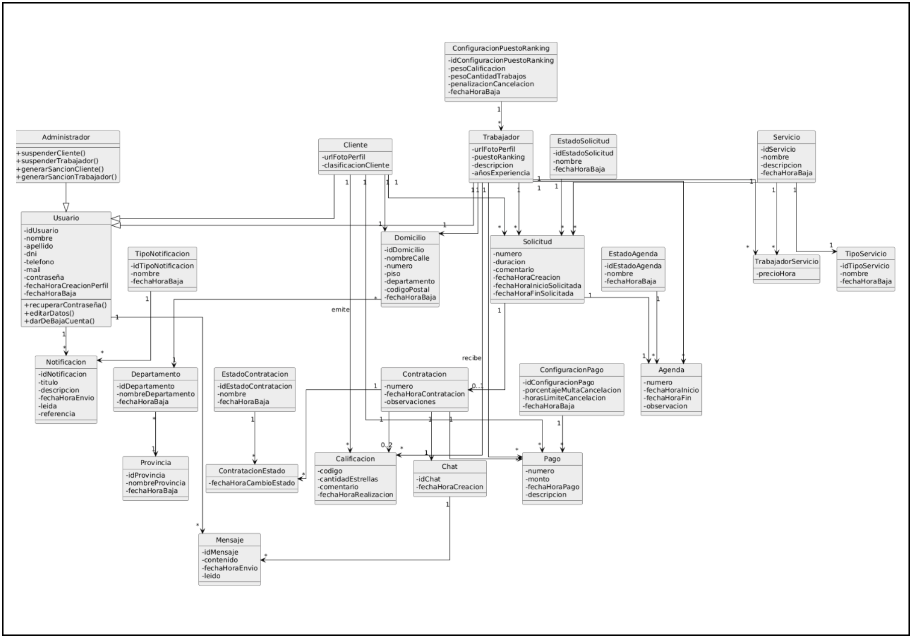

# RitualFresh FINAL

RitualFresh es una plataforma web orientada a centralizar la contratación de servicios domésticos de limpieza y mantenimiento del hogar. El sistema busca conectar clientes, trabajadores independientes y empresas prestadoras de servicios mediante un entorno organizado, transparente y confiable.

El proyecto se desarrolla para la materia Seminario Integrador de la UTN-FRM.

## Idea del proyecto

La propuesta surge a partir de una problemática cotidiana: muchas personas necesitan contratar servicios de limpieza o mantenimiento del hogar, pero suelen hacerlo mediante recomendaciones personales, redes sociales o contactos informales. Esto genera información dispersa, dificultad para comparar alternativas y poca confianza al momento de elegir un prestador.

Al mismo tiempo, muchos trabajadores independientes tienen pocas herramientas para mostrar sus servicios, experiencia, disponibilidad y referencias. RitualFresh busca mejorar esa vinculación mediante una plataforma que organice la información y facilite la contratación.

## Problema a resolver

El proceso actual de búsqueda y contratación de servicios domésticos presenta varios problemas:

- Uso de medios informales para encontrar trabajadores.
- Falta de información centralizada sobre servicios, experiencia y disponibilidad.
- Dificultad para comparar prestadores.
- Poca visibilidad para trabajadores independientes.
- Ausencia de referencias o evaluaciones confiables.
- Menor transparencia en los acuerdos de trabajo.

Como consecuencia, los clientes tienen más incertidumbre al contratar y los trabajadores pierden oportunidades laborales o dependen de intermediarios que reducen su ingreso final.

## Objetivo general

Desarrollar una plataforma web que permita centralizar, organizar y optimizar la contratación de servicios domésticos de limpieza y mantenimiento del hogar, facilitando la interacción entre clientes, trabajadores independientes y empresas mediante un sistema estructurado, transparente y confiable.

## Objetivos específicos

- Permitir que trabajadores y empresas creen perfiles con servicios, experiencia, especialidades, disponibilidad y precios orientativos.
- Facilitar la búsqueda de prestadores mediante filtros por tipo de servicio, ubicación, precio, disponibilidad y reputación.
- Incorporar solicitudes de servicio con información clara sobre fecha, horario, tipo de tarea y condiciones del trabajo.
- Registrar el estado de cada contratación para mejorar la trazabilidad del servicio.
- Permitir calificaciones y comentarios para generar confianza entre usuarios.
- Integrar comunicación interna entre cliente y trabajador.
- Incorporar pagos mediante plataformas externas, sin gestionar directamente datos financieros sensibles.
- Brindar historial y estadísticas de uso para clientes, trabajadores y administradores.

## Actores principales

| Actor | Descripción |
|---|---|
| Cliente | Usuario que busca, compara y contrata servicios domésticos. |
| Trabajador | Usuario que ofrece servicios de limpieza o mantenimiento de forma independiente. |
| Empresa | Prestador que puede registrar y gestionar personal dentro de la plataforma. |
| Administrador | Usuario encargado de supervisar usuarios, reclamos, categorías y actividad general del sistema. |

## Alcance funcional

El sistema contempla los siguientes módulos principales:

| Módulo | Descripción |
|---|---|
| Gestión de usuarios y autenticación | Registro, inicio de sesión, recuperación de contraseña, validación de cuenta y roles de usuario. |
| Gestión de perfiles | Perfiles de clientes, trabajadores y empresas con información personal, servicios, experiencia, disponibilidad y precios orientativos. |
| Búsqueda y selección | Búsqueda de trabajadores o servicios mediante filtros por categoría, ubicación, precio, disponibilidad y reputación. |
| Contratación del servicio | Solicitud, aceptación, rechazo, seguimiento, finalización y cancelación de servicios. |
| Chat y comunicación | Mensajería interna para coordinar detalles del servicio entre cliente y trabajador. |
| Historial y estadísticas | Consulta de servicios realizados, métricas de desempeño y actividad de usuarios. |
| Calificaciones y reputación | Evaluación del servicio mediante calificaciones, comentarios y reputación del prestador. |
| Notificaciones | Alertas sobre solicitudes, mensajes, pagos, cancelaciones y otros eventos relevantes. |
| Pagos | Integración con plataforma externa de pago para confirmar servicios, gestionar reembolsos y liquidaciones. |
| Geolocalización | Selección de ubicación mediante mapa para mejorar la precisión de las búsquedas y contrataciones. |

## Requerimientos principales

### Gestión de usuarios y autenticación

- Registro como cliente o trabajador.
- Inicio de sesión mediante correo y contraseña.
- Recuperación de contraseña por correo electrónico.
- Validación de cuenta.
- Diferenciación de roles.

### Gestión de perfiles

- Creación y edición de perfiles.
- Perfil de trabajador con servicios ofrecidos, experiencia, zona de trabajo, disponibilidad y precios orientativos.
- Perfil de cliente con información personal, dirección y preferencias de contratación.
- Visualización de perfiles para facilitar la comparación.

### Búsqueda y selección

- Búsqueda por trabajador o tipo de servicio.
- Filtros por categoría, ubicación, precio y reputación.
- Ordenamiento por ranking de trabajadores.
- Visualización de resultados con información relevante para decidir.

### Contratación del servicio

- Solicitud de contratación por parte del cliente.
- Aceptación o rechazo de la solicitud por parte del trabajador.
- Registro de estados como pendiente, aceptado, en curso, finalizado o cancelado.
- Gestión de cancelaciones y reglas asociadas.

### Comunicación

- Mensajería interna entre cliente y trabajador.
- Notificaciones de nuevos mensajes.
- Historial de conversaciones para consultar acuerdos previos.

### Historial, estadísticas y reportes

- Historial de servicios realizados.
- Visualización de trabajos completados, pendientes o cancelados.
- Estadísticas para trabajadores y clientes.
- Reportes administrativos sobre usuarios, contrataciones, reclamos e incidencias.

### Calificaciones y reputación

- Calificación del servicio al finalizar una contratación.
- Comentarios de usuarios.
- Promedio de calificaciones y reputación del trabajador.
- Uso de la reputación como criterio para ordenar resultados.

### Pagos

- Integración con Mercado Pago u otra plataforma externa.
- Checkout para confirmar servicios.
- Registro de transacciones.
- Reembolsos por cancelación.
- Liquidación del monto correspondiente al trabajador.

### Geolocalización

- Selección de ubicación mediante mapa.
- Almacenamiento de coordenadas asociadas al perfil o contratación.
- Uso de la ubicación para mejorar búsquedas y contrataciones.

## Desarrollo por módulos

La implementación se organizará por módulos funcionales para mantener trazabilidad entre requerimientos, historias de usuario, pantallas y código.

| Módulo | Identificador | Funcionalidades base |
|---|---|---|
| Gestión de usuarios y autenticación | M01 | Registro, inicio de sesión, recuperación de contraseña, validación de cuenta y roles. |
| Gestión de perfiles | M02 | Perfil del trabajador, perfil del cliente, edición y visualización de datos. |
| Búsqueda y selección | M03 | Buscador, filtros, resultados y ranking de trabajadores. |
| Contratación del servicio | M04 | Solicitudes, aceptación/rechazo, estados, finalización y cancelación. |
| Chat y comunicación | M05 | Mensajería interna, mensajes predeterminados e historial de conversaciones. |
| Historial y estadísticas | M06 | Historial de servicios y estadísticas para cliente, trabajador y administración. |
| Calificaciones y reputación | M07 | Calificación del servicio, comentarios y reputación del trabajador. |
| Notificaciones | M08 | Panel de notificaciones, estados de lectura y alertas automáticas. |
| Pagos | M09 | Checkout, pagos, reembolsos, liquidaciones y trazabilidad financiera. |
| Geolocalización | M10 | Selección de ubicación, coordenadas y mapa interactivo. |

## Diseño del sistema

La etapa de diseño define el comportamiento funcional y visual de RitualFresh a partir de historias de usuario, criterios de aceptación, modelo de datos, pantallas, reportes y reglas de navegación.

El modelo funcional se organiza por módulos y utiliza historias de usuario con identificadores como `US01-M01-RF01`, lo que permite mantener trazabilidad entre requerimientos, pantallas y funcionalidades.

### Diagrama de clases

El siguiente diagrama resume las clases principales previstas para el modelo orientado a objetos del sistema.



Entre las pantallas principales se incluyen:

- Registro de usuario.
- Inicio de sesión.
- Recuperación de contraseña.
- Perfil del trabajador.
- Perfil del cliente.
- Búsqueda y selección de prestadores.
- Solicitud de contratación.
- Gestión de solicitudes pendientes.
- Gestión de contrataciones.
- Chat activo.
- Historial de servicios.
- Estadísticas del trabajador.
- Estadísticas del cliente.
- Calificación de servicios.
- Panel de notificaciones.
- Checkout y estados de pago.
- Selección de ubicación mediante mapa.

También se contemplan reportes administrativos, como dashboard general, reporte tabular de contrataciones y reporte de reclamos e incidencias.

## Estructura inicial del proyecto

La estructura inicial de código se organiza separando backend y frontend dentro del mismo repositorio. El backend se estructura como un proyecto Java orientado a objetos con Maven y Spring Boot, agrupando los paquetes según las clases y responsabilidades del diagrama. El frontend se prepara como una aplicación React organizada por pantallas, componentes reutilizables, servicios y módulos funcionales.

```text
backend/
├── pom.xml
└── src/
    ├── main/
    │   ├── java/
    │   │   └── ritualfresh/
    │   │       ├── agenda/
    │   │       ├── calificaciones/
    │   │       ├── chat/
    │   │       ├── compartido/
    │   │       ├── contrataciones/
    │   │       ├── notificaciones/
    │   │       ├── pagos/
    │   │       ├── perfiles/
    │   │       ├── servicios/
    │   │       ├── solicitudes/
    │   │       ├── ubicaciones/
    │   │       └── usuarios/
    │   └── resources/
    └── test/
        └── java/
            └── ritualfresh/

frontend/
├── public/
└── src/
    ├── app/
    ├── assets/
    ├── components/
    ├── features/
    │   ├── busqueda/
    │   ├── calificaciones/
    │   ├── chat/
    │   ├── contrataciones/
    │   ├── geolocalizacion/
    │   ├── historial/
    │   ├── notificaciones/
    │   ├── pagos/
    │   ├── perfiles/
    │   └── usuarios/
    ├── pages/
    ├── services/
    └── styles/
```

## Alcance no incluido en esta etapa

Para mantener un alcance realista dentro del tiempo académico, no se incluyen en esta etapa:

- Aplicación móvil nativa.
- Múltiples pasarelas de pago.
- Gestión directa de datos financieros sensibles.
- Verificación biométrica.
- Recomendaciones con inteligencia artificial.
- Expansión a categorías no relacionadas con limpieza y mantenimiento del hogar.

## Innovación y sustentabilidad

RitualFresh propone una forma más estructurada y digital de gestionar la contratación de servicios domésticos. La plataforma incorpora perfiles profesionales, calificaciones, historial de trabajos, registro de contrataciones, reclamos, notificaciones y pagos digitales.

Desde el punto de vista social, busca dar mayor visibilidad a trabajadores independientes y mejorar la confianza entre las partes. Desde el punto de vista económico, contribuye a ordenar el mercado de servicios domésticos y a transparentar precios, condiciones y oportunidades laborales.

El proyecto se vincula con los siguientes Objetivos de Desarrollo Sostenible:

- ODS 8: Trabajo decente y crecimiento económico.
- ODS 9: Industria, innovación e infraestructura.
- ODS 10: Reducción de las desigualdades.

## Integrantes

| Integrante | Legajo |
|---|---|
| Becerra, Joaquín | 50799 |
| Fiore, Guillermina | 50024 |
| Zalazar, Juan | 51156 |

El equipo trabajará de forma colaborativa en las distintas etapas del desarrollo.

## Estado actual

El proyecto se encuentra en etapa de Desarrollo e Implementación. Ya se elaboraron las etapas de Anteproyecto, Requerimientos y Diseño, y se completó la base backend de las historias de usuario previstas para los módulos M01 y M02.

## Configuración local

Cada integrante debe crear su propio archivo `.env` local con las variables de entorno necesarias para ejecutar el proyecto. El archivo `.env` y sus variantes no deben subirse al repositorio porque pueden contener credenciales, rutas locales o datos sensibles.

El backend utiliza JPA/Hibernate y PostgreSQL para persistir los datos iniciales de los módulos M01 y M02. La configuración por defecto espera una base local con estos valores:

| Variable | Valor por defecto |
|---|---|
| `RITUALFRESH_DB_URL` | `jdbc:postgresql://localhost:5432/ritualfresh` |
| `RITUALFRESH_DB_USER` | `ritualfresh` |
| `RITUALFRESH_DB_PASSWORD` | `ritualfresh` |

Para levantar PostgreSQL con Docker:

```bash
docker compose up -d postgres
```

Para ejecutar las pruebas del backend:

```bash
cd backend
mvn test
```

Para iniciar el backend local:

```bash
cd backend
mvn spring-boot:run
```

Para instalar y ejecutar el frontend local:

```bash
cd frontend
npm install
npm run dev
```

El frontend utiliza Vite con proxy local hacia `http://localhost:8080`, por lo que el backend debe estar iniciado para probar los formularios contra la API.

Endpoints iniciales del módulo M01:

| Método | Ruta | Descripción |
|---|---|---|
| POST | `/api/usuarios/registro` | Registra un usuario cliente o trabajador y genera token de validación. |
| GET | `/api/usuarios/validacion?token=...` | Valida la cuenta asociada al token recibido. |
| POST | `/api/usuarios/login` | Inicia sesión con correo y contraseña si la cuenta está activa y genera `tokenSesion`. |
| POST | `/api/usuarios/recuperacion-contrasena` | Solicita recuperación de contraseña mediante correo electrónico registrado. |
| POST | `/api/usuarios/recuperacion-contrasena/confirmacion` | Confirma el cambio de contraseña mediante token de recuperación. |
| POST | `/api/usuarios/logout` | Cierra la sesión activa usando `Authorization: Bearer <tokenSesion>`. |

Hasta integrar un servicio real de correo, los endpoints de validación de cuenta y recuperación de contraseña devuelven los tokens en la respuesta para facilitar las pruebas locales.

Endpoints iniciales del módulo M02:

| Método | Ruta | Descripción |
|---|---|---|
| POST | `/api/perfiles/clientes` | Crea el perfil del cliente autenticado usando `Authorization: Bearer <tokenSesion>`. |
| POST | `/api/perfiles/trabajadores` | Crea el perfil del trabajador autenticado usando `Authorization: Bearer <tokenSesion>`. |
| GET | `/api/perfiles/me` | Consulta el perfil del usuario autenticado. |
| PUT | `/api/perfiles/clientes/me` | Edita el perfil del cliente autenticado. |
| PUT | `/api/perfiles/trabajadores/me` | Edita el perfil del trabajador autenticado. |

### Trazabilidad de historias implementadas

| Identificación | Módulo | Alcance backend implementado |
|---|---|---|
| `US01-M01-RF01` | M01 | Registro de usuario cliente o trabajador, validación de campos obligatorios, correo único, formato de correo y confirmación de contraseña. |
| `US04-M01-RF04` | M01 | Validación de cuenta por token para cumplir la precondición de inicio de sesión con cuenta validada. |
| `US02-M01-RF02` | M01 | Inicio de sesión con correo y contraseña, rechazo de credenciales inválidas, cuenta pendiente o cuenta no activa, y generación de sesión. |
| `US03-M01-RF03` | M01 | Recuperación de contraseña por correo registrado, token con vencimiento y confirmación de nueva contraseña. |
| `US01-M02-RF01` | M02 | Perfil del trabajador autenticado con descripción, años de experiencia, servicios ofrecidos, zona de trabajo, disponibilidad y precio por hora orientativo. |
| `US02-M02-RF02` | M02 | Perfil del cliente autenticado con teléfono de contacto, dirección y preferencias de contratación. |

Las pantallas iniciales del frontend permiten operar los flujos `M01-WFR-01`, `M01-WFR-02`, `M01-WFR-03`, `M01-WFR-04`, `M02-WFR-01` y `M02-WFR-02` desde una interfaz React.

## Versiones

| Versión | Fecha | Funcionalidades incluidas | Responsable |
|---|---|---|---|
| v0.1 | 2026-06-07 | Creación del repositorio, configuración inicial de ramas y CODEOWNERS. | Equipo RitualFresh |
| v0.2 | 2026-06-07 | README consolidado con síntesis de anteproyecto, requerimientos y diseño. | Equipo RitualFresh |
| v0.3 | 2026-06-07 | README actualizado con tildes, legajos de integrantes y organización por módulos. | Equipo RitualFresh |
| v0.4 | 2026-06-08 | Incorporación del diagrama de clases y estructura inicial Java orientada a objetos sin Maven. | Equipo RitualFresh |
| v0.5 | 2026-06-08 | Incorporación de la estructura inicial del frontend React por módulos funcionales. | Equipo RitualFresh |
| v0.6 | 2026-06-08 | Incorporación de `.gitignore` y plantilla `.env.example` para configuración local. | Equipo RitualFresh |
| v0.7 | 2026-06-08 | Eliminación de `.env.example` del repositorio y ajuste de exclusión de variables de entorno. | Equipo RitualFresh |
| v0.8 | 2026-06-09 | Incorporación de la base backend para registro, validación de cuenta e inicio de sesión del módulo M01. | Equipo RitualFresh |
| v0.9 | 2026-06-09 | Incorporación de Maven, JUnit 5 y Lombok para pruebas automatizadas y reducción de código repetitivo. | Equipo RitualFresh |
| v1.0 | 2026-06-09 | Conversión del backend a Spring Boot y exposición de endpoints REST iniciales para el módulo M01. | Equipo RitualFresh |
| v1.1 | 2026-06-09 | Migración del módulo M01 a persistencia con JPA/Hibernate, PostgreSQL y BCrypt para contraseñas. | Equipo RitualFresh |
| v1.2 | 2026-06-09 | Incorporación del backend inicial del módulo M02 para creación, consulta y edición de perfiles de cliente y trabajador. | Equipo RitualFresh |
| v1.3 | 2026-06-09 | Finalización backend de las historias M01 y M02 con recuperación de contraseña, sesiones autenticadas, perfiles completos y trazabilidad por identificador. | Equipo RitualFresh |
| v1.4 | 2026-06-09 | Incorporación del frontend React inicial para operar los flujos de usuarios, autenticación, recuperación de contraseña y perfiles. | Equipo RitualFresh |
