# RitualFresh

Plataforma web académica para la gestión de servicios domésticos de limpieza y mantenimiento del hogar.

## Referencias principales

- [Contexto del proyecto](docs/context/PROJECT_CONTEXT.md)
- [Alcance](docs/context/SCOPE.md)
- [Módulos funcionales](docs/context/MODULES.md)
- [Reglas de negocio](docs/context/BUSINESS_RULES.md)
- [Guía de implementación](docs/development/IMPLEMENTATION_GUIDE.md)
- [Estado del modelo de datos](docs/architecture/DATA_MODEL_STATUS.md)
- [Índice de historias](docs/requirements/USER_STORIES_INDEX.md)

## Stack base

- Backend: Java 21, Spring Boot 3.5.x, Maven, PostgreSQL.
- Frontend: React 19, Node.js 22, Bootstrap 5.3.

## Estado actual

El proyecto ya cuenta con una base backend funcional para:

- `M01`: gestión de usuarios, validación de cuenta, login, logout, recuperación de contraseña y sesiones opacas persistidas.
- `M02`: creación, consulta y actualización de perfiles de cliente y trabajador.
- administración mínima: listado de usuarios, detalle, cambio de estado y métricas básicas.

La autenticación y autorización del backend se resuelven con Spring Security, manteniendo el modelo actual de `UserSession` y el uso de `Authorization: Bearer <sessionToken>`.

El modelo de datos general sigue sujeto a revisión para módulos posteriores, pero las entidades actuales de `auth`, `profiles` y `admin` ya se encuentran implementadas y probadas.

## Diagrama de clases del módulo `auth`

Para este módulo conviene priorizar las clases de `model`, pero también resulta útil mostrar cómo se conectan con `controller`, `service` y `repository`. En este primer diagrama se omiten los DTOs para no sobredimensionar la vista y preservar la legibilidad.

```mermaid
classDiagram
    direction LR

    class User {
        +Long id
        +String firstName
        +String lastName
        +String documentNumber
        +String phoneNumber
        +String email
        +String passwordHash
        +UserRole role
        +AccountStatus accountStatus
        +LocalDateTime createdAt
        +LocalDateTime deactivatedAt
        +String accountValidationToken
        +LocalDateTime accountValidationTokenExpiresAt
        +String passwordResetToken
        +LocalDateTime passwordResetTokenExpiresAt
        +register(data) User
        +validateAccount()
        +startAccountValidation(token, expiresAt)
        +hasValidAccountValidationToken(now) boolean
        +editData(firstName, lastName, documentNumber, phoneNumber)
        +changePassword(passwordHash)
        +startPasswordReset(token, expiresAt)
        +hasValidPasswordResetToken(now) boolean
        +changeAccountStatus(accountStatus)
        +deactivate()
        +isActive() boolean
    }

    class UserSession {
        +Long id
        +String token
        +LocalDateTime createdAt
        +LocalDateTime expiresAt
        +LocalDateTime closedAt
        +isActive(now) boolean
        +close(closedAt)
    }

    class UserRole {
        <<enumeration>>
        CLIENT
        WORKER
        ADMIN
    }

    class AccountStatus {
        <<enumeration>>
        PENDING_VALIDATION
        ACTIVE
        SUSPENDED
        DELETED
    }

    class UserController {
        +registerUser(request) RegisterUserApiResponse
        +validateAccount(token) AccountValidationApiResponse
        +resendAccountValidation(request) ResendAccountValidationApiResponse
        +login(request, response) LoginApiResponse
        +requestPasswordReset(request) PasswordResetApiResponse
        +confirmPasswordReset(request) MessageApiResponse
        +closeSession(authentication, response) MessageApiResponse
        +deleteMyAccount(authentication, response) MessageApiResponse
    }

    class UserService {
        +registerUser(request) RegisterUserResult
        +validateAccount(token) User
        +resendAccountValidation(email) void
        +login(request) LoginResult
        +getAuthenticatedUser(sessionToken) User
        +closeSession(sessionToken) void
        +deleteAuthenticatedAccount(sessionToken) void
        +getAuthenticatedUser() User
        +getAuthenticatedSessionToken() String
        +requestPasswordReset(request) PasswordResetResult
        +confirmPasswordReset(request) User
    }

    class UserRepository {
        <<interface>>
        +save(user) User
        +findAll() List~User~
        +findById(id) Optional~User~
        +findByEmail(email) Optional~User~
        +findByAccountValidationToken(token) Optional~User~
        +findByPasswordResetToken(token) Optional~User~
        +existsByEmail(email) boolean
    }

    class UserSessionRepository {
        <<interface>>
        +save(session) UserSession
        +findByToken(token) Optional~UserSession~
    }

    class JpaUserRepository {
        +save(user) User
        +findAll() List~User~
        +findById(id) Optional~User~
        +findByEmail(email) Optional~User~
        +findByAccountValidationToken(token) Optional~User~
        +findByPasswordResetToken(token) Optional~User~
        +existsByEmail(email) boolean
    }

    class JpaUserSessionRepository {
        +save(session) UserSession
        +findByToken(token) Optional~UserSession~
    }

    class InMemoryUserRepository {
        +save(user) User
        +findAll() List~User~
        +findById(id) Optional~User~
        +findByEmail(email) Optional~User~
        +findByAccountValidationToken(token) Optional~User~
        +findByPasswordResetToken(token) Optional~User~
        +existsByEmail(email) boolean
    }

    class InMemoryUserSessionRepository {
        +save(session) UserSession
        +findByToken(token) Optional~UserSession~
    }

    class UserJpaRepository {
        <<interface>>
        +findByEmail(email) Optional~User~
        +findByAccountValidationToken(token) Optional~User~
        +findByPasswordResetToken(token) Optional~User~
        +existsByEmail(email) boolean
    }

    class UserSessionJpaRepository {
        <<interface>>
        +findByToken(token) Optional~UserSession~
    }

    class AccountEmailService {
        <<interface>>
        +sendAccountValidationEmail(user, token, expiresAt) void
        +sendPasswordResetEmail(user, token, expiresAt) void
    }

    class PasswordSecurity {
        <<utility>>
        +generateHash(password) String
        +matches(rawPassword, passwordHash) boolean
    }

    User "1" --> "0..*" UserSession : mantiene
    User --> UserRole : usa
    User --> AccountStatus : usa

    UserController ..> UserService : delega
    UserService ..> UserRepository : usa
    UserService ..> UserSessionRepository : usa
    UserService ..> AccountEmailService : notifica
    UserService ..> PasswordSecurity : cifra/valida
    UserService ..> User : gestiona
    UserService ..> UserSession : crea/cierra

    UserRepository <|.. JpaUserRepository
    UserRepository <|.. InMemoryUserRepository
    UserSessionRepository <|.. JpaUserSessionRepository
    UserSessionRepository <|.. InMemoryUserSessionRepository

    JpaUserRepository ..> UserJpaRepository : adapta
    JpaUserSessionRepository ..> UserSessionJpaRepository : adapta
    UserJpaRepository --> User : persiste
    UserSessionJpaRepository --> UserSession : persiste
```

## Variables de entorno

El backend usa `application.properties` solo para leer configuración, pero los valores sensibles deben venir de variables de entorno.

- Para desarrollo con Docker Compose, conviene definirlas en un archivo `.env` en la raíz del proyecto.
- El repositorio incluye [.env.example](/Users/guillermina/Downloads/4º%20año/primer%20semestre/seminario%20integrador/RitualFresh/.env.example:1) como plantilla.
- `docker-compose.yml` toma esas variables y se las pasa al contenedor `backend`.

Para el envío de correos con Mailtrap, completar al menos:

- `RITUALFRESH_MAIL_ENABLED`
- `RITUALFRESH_MAIL_FROM`
- `RITUALFRESH_BACKEND_BASE_URL`
- `RITUALFRESH_FRONTEND_BASE_URL`
- `SPRING_MAIL_HOST`
- `SPRING_MAIL_PORT`
- `SPRING_MAIL_USERNAME`
- `SPRING_MAIL_PASSWORD`
