# RitualFresh

Plataforma web académica para la gestión de servicios domésticos de limpieza y mantenimiento del hogar.

## Referencias principales

- [Contexto del proyecto](docs/context/PROJECT_CONTEXT.md)
- [Alcance](docs/context/SCOPE.md)
- [Módulos funcionales](docs/context/MODULES.md)
- [Reglas de negocio](docs/context/BUSINESS_RULES.md)
- [Guía de implementación](docs/development/IMPLEMENTATION_GUIDE.md)
- [Estado del modelo de datos](docs/architecture/DATA_MODEL_STATUS.md)
- [Índice de historias](docs/requirements/USER_STORIES_INDEX.md)
- [Requisitos de M06 - Historial y Estadísticas](docs/requirements/M06_HISTORIAL_ESTADISTICAS.md)
- [Requisitos de M08 - Notificaciones](docs/requirements/M08_NOTIFICACIONES.md)

## Stack base

- Backend: Java 21, Spring Boot 3.5.x, Maven, PostgreSQL.
- Frontend: React 19, Node.js 22, Bootstrap 5.3.

## Guía visual RitualFresh

- Referencia obligatoria: [frontend/docs/UI_GUIDELINES.md](frontend/docs/UI_GUIDELINES.md)
- Cualquier cambio visual futuro debe respetar esa guía antes de modificar componentes o tokens.

## Estado actual

El proyecto ya cuenta con una base backend funcional para:

- `M01`: registro, validación y reenvío de validación de cuenta, login (email/contraseña y Google OAuth), logout, autoeliminación lógica de la cuenta, recuperación de contraseña y sesiones opacas persistidas.
- `M02`: creación, consulta y actualización de perfiles de cliente y trabajador.
- `M05`: base independiente de chat entre cliente y trabajador, con conversaciones reutilizables por pareja, mensajes persistidos, historial paginado, lectura por mensaje, presencia y WebSocket. La habilitación definitiva queda desacoplada de `M04` hasta integrar su contrato.
- `M06`: read model persistente de servicios, historial propio paginado y estadísticas móviles para clientes y trabajadores. No expone altas públicas y queda preparado para recibir eventos internos de `M04`, `M07` y `M09`.
- `M08`: centro de notificaciones in-app persistente para todos los roles, con últimas 20, contador exacto, lectura individual y masiva, WebSocket autenticado e integración interna idempotente preparada para `M04`, `M09` y `M11`.
- administración de cuentas: métricas, directorio paginado, detalle y cambios de estado auditados.

En frontend ya se encuentran implementados los flujos base para:

- autenticación, validación y recuperación de contraseña;
- dashboard mínimo por rol;
- panel administrativo en `/admin/home`, directorio en `/admin/users` y detalle auditado en `/admin/users/:userId`;
- gestión de perfil propio para `CLIENT` y `WORKER` en la ruta protegida `/profiles`.
- chat inicial para `CLIENT` y `WORKER` en la ruta protegida `/chat`.
- historial en `/history` y estadísticas por rol en `/statistics`, ambas rutas protegidas para clientes y trabajadores.
- campana y panel de notificaciones responsive en todas las pantallas autenticadas de cliente, trabajador y administrador.

La autenticación y autorización del backend se resuelven con Spring Security, manteniendo el modelo actual de `UserSession`. Además del login por email/contraseña, el sistema integra inicio de sesión con Google mediante OAuth 2.0, que tras la autenticación externa crea o reutiliza un usuario local y establece la misma cookie `HttpOnly` de sesión. El transporte principal de sesión entre frontend y backend se realiza mediante cookie `HttpOnly`, aunque el backend todavía conserva compatibilidad técnica con `Authorization: Bearer <sessionToken>` para pruebas y debugging.

El modelo de datos general sigue sujeto a revisión para módulos posteriores, pero las entidades actuales de `auth`, `profiles`, `admin`, `chat`, `history` y `notifications` ya se encuentran implementadas y probadas.

## Cobertura de diagramas de clases

Los diagramas distinguen entre clases existentes y diseño previsto. En los módulos implementados se representan las clases y dependencias relevantes del código actual; en los módulos pendientes se propone una estructura inicial para discutir y ajustar antes de implementarla. Los DTOs triviales y adaptadores repetitivos pueden omitirse para conservar la legibilidad.

| Alcance | Paquete o módulo | Estado del diagrama |
|---|---|---|
| M01 | `auth` | Implementado |
| M02 | `profiles` | Implementado |
| M03 | `search` | Diseño propuesto |
| M04 | `contracts` | Diseño propuesto |
| M05 | `chat` | Implementación inicial existente |
| M06 | `history` | Implementado como read model |
| M07 | `ratings` | Diseño propuesto |
| M08 | `notifications` | Implementado para notificaciones in-app |
| M09 | `payments` | Diseño propuesto |
| M10 | `geolocation` | Diseño propuesto |
| M11 | `claims` | Diseño propuesto |
| Soporte transversal | `admin` | Implementado |

## Diagrama de clases del módulo `auth`

Para este módulo conviene priorizar las clases de `model`, pero también resulta útil mostrar cómo se conectan con `controller`, `service` y `repository`. En este primer diagrama se omiten los DTOs para no sobredimensionar la vista y preservar la legibilidad.

```mermaid
classDiagram
    direction LR

    class User {
        +Long id
        +String firstName
        +String lastName
        +String documentNumber
        +String phoneNumber
        +String email
        +String passwordHash
        +UserRole role
        +AccountStatus accountStatus
        +LocalDateTime createdAt
        +LocalDateTime deactivatedAt
        +String accountValidationToken
        +LocalDateTime accountValidationTokenExpiresAt
        +String passwordResetToken
        +LocalDateTime passwordResetTokenExpiresAt
        +register(data) User
        +validateAccount()
        +startAccountValidation(token, expiresAt)
        +hasValidAccountValidationToken(now) boolean
        +editData(firstName, lastName, documentNumber, phoneNumber)
        +changePassword(passwordHash)
        +startPasswordReset(token, expiresAt)
        +hasValidPasswordResetToken(now) boolean
        +changeAccountStatus(accountStatus)
        +deactivate()
        +isActive() boolean
    }

    class UserSession {
        +Long id
        +String token
        +LocalDateTime createdAt
        +LocalDateTime expiresAt
        +LocalDateTime closedAt
        +isActive(now) boolean
        +close(closedAt)
    }

    class UserRole {
        <<enumeration>>
        CLIENT
        WORKER
        ADMIN
    }

    class AccountStatus {
        <<enumeration>>
        PENDING_VALIDATION
        ACTIVE
        SUSPENDED
        DELETED
    }

    class UserController {
        +registerUser(request) RegisterUserApiResponse
        +validateAccount(token) AccountValidationApiResponse
        +resendAccountValidation(request) ResendAccountValidationApiResponse
        +login(request, response) LoginApiResponse
        +requestPasswordReset(request) PasswordResetApiResponse
        +confirmPasswordReset(request) MessageApiResponse
        +closeSession(authentication, response) MessageApiResponse
        +deleteMyAccount(authentication, response) MessageApiResponse
    }

    class UserService {
        +registerUser(request) RegisterUserResult
        +validateAccount(token) User
        +resendAccountValidation(email) void
        +login(request) LoginResult
        +loginWithGoogle(profileData) LoginResult
        +updateUserRole(userId, newRole) User
        +getAuthenticatedUser(sessionToken) User
        +getAuthenticatedSession(sessionToken) LoginResult
        +closeSession(sessionToken) void
        +deleteAuthenticatedAccount(sessionToken) void
        +getAuthenticatedUser() User
        +getAuthenticatedSessionToken() String
        +requestPasswordReset(request) PasswordResetResult
        +confirmPasswordReset(request) User
    }

    class UserRepository {
        <<interface>>
        +save(user) User
        +findAll() List~User~
        +findById(id) Optional~User~
        +findByEmail(email) Optional~User~
        +findByAccountValidationToken(token) Optional~User~
        +findByPasswordResetToken(token) Optional~User~
        +existsByEmail(email) boolean
    }

    class UserSessionRepository {
        <<interface>>
        +save(session) UserSession
        +findByToken(token) Optional~UserSession~
    }

    class JpaUserRepository {
        +save(user) User
        +findAll() List~User~
        +findById(id) Optional~User~
        +findByEmail(email) Optional~User~
        +findByAccountValidationToken(token) Optional~User~
        +findByPasswordResetToken(token) Optional~User~
        +existsByEmail(email) boolean
    }

    class JpaUserSessionRepository {
        +save(session) UserSession
        +findByToken(token) Optional~UserSession~
    }

    class InMemoryUserRepository {
        +save(user) User
        +findAll() List~User~
        +findById(id) Optional~User~
        +findByEmail(email) Optional~User~
        +findByAccountValidationToken(token) Optional~User~
        +findByPasswordResetToken(token) Optional~User~
        +existsByEmail(email) boolean
    }

    class InMemoryUserSessionRepository {
        +save(session) UserSession
        +findByToken(token) Optional~UserSession~
    }

    class UserJpaRepository {
        <<interface>>
        +findByEmail(email) Optional~User~
        +findByAccountValidationToken(token) Optional~User~
        +findByPasswordResetToken(token) Optional~User~
        +existsByEmail(email) boolean
    }

    class UserSessionJpaRepository {
        <<interface>>
        +findByToken(token) Optional~UserSession~
    }

    class AccountEmailService {
        <<interface>>
        +sendAccountValidationEmail(user, token, expiresAt) void
        +sendPasswordResetEmail(user, token, expiresAt) void
    }

    class PasswordSecurity {
        <<utility>>
        +generateHash(password) String
        +matches(rawPassword, passwordHash) boolean
    }

    class GoogleOAuth2SuccessHandler {
        +onAuthenticationSuccess(request, response, authentication) void
    }

    class OAuth2ProfileData {
        +String email
        +String firstName
        +String lastName
    }

    User "1" --> "0..*" UserSession : mantiene
    User --> UserRole : usa
    User --> AccountStatus : usa

    UserController ..> UserService : delega
    UserService ..> UserRepository : usa
    UserService ..> UserSessionRepository : usa
    UserService ..> AccountEmailService : notifica
    UserService ..> PasswordSecurity : cifra/valida
    UserService ..> User : gestiona
    UserService ..> UserSession : crea/cierra

    UserRepository <|.. JpaUserRepository
    UserRepository <|.. InMemoryUserRepository
    UserSessionRepository <|.. JpaUserSessionRepository
    UserSessionRepository <|.. InMemoryUserSessionRepository

    JpaUserRepository ..> UserJpaRepository : adapta
    JpaUserSessionRepository ..> UserSessionJpaRepository : adapta
    UserJpaRepository --> User : persiste
    UserSessionJpaRepository --> UserSession : persiste

    GoogleOAuth2SuccessHandler ..> UserService : usa
    GoogleOAuth2SuccessHandler ..> OAuth2ProfileData : extrae
    UserService ..> OAuth2ProfileData : recibe
    UserService ..> User : oauthAccount()
    UserController ..> UserService : updateUserRole()
```

## Diagrama de clases del módulo `history`

M06 utiliza un read model propio para habilitar consultas reales antes de que existan contratación, pagos y calificaciones completos. El módulo no expone operaciones públicas de escritura: futuros módulos alimentarán `ServiceHistoryRecord` mediante integración interna.

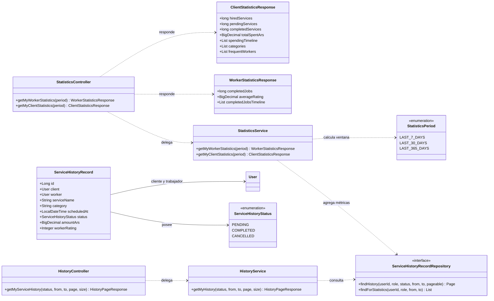

## Diagrama de clases del módulo `profiles`

Siguiendo el mismo criterio que en `auth`, en este diagrama se priorizan las clases de `model` y se agregan `controller`, `service` y `repository` para mostrar cómo se articula el módulo. Los DTOs también se omiten para conservar una vista más clara del flujo principal.

```mermaid
classDiagram
    direction LR

    class User {
        +Long id
        +UserRole role
        +isActive() boolean
    }

    class ClientProfile {
        +Long id
        +String photoUrl
        +int clientRating
        +String contactPhone
        +String streetName
        +String streetNumber
        +String floor
        +String apartment
        +String postalCode
        +String city
        +String province
        +ServiceFrequency serviceFrequency
        +Set~PreferredTimeSlot~ preferredTimeSlots
        +Set~ServiceInterest~ serviceInterests
        +String otherServiceInterest
        +String additionalNotes
        +edit(photoUrl, contactPhone, address, preferences)
    }

    class WorkerProfile {
        +Long id
        +String photoUrl
        +int rankingPosition
        +String description
        +int yearsOfExperience
        +String offeredServices
        +String workArea
        +String availability
        +BigDecimal hourlyRate
        +edit(photoUrl, description, yearsOfExperience, offeredServices, workArea, availability, hourlyRate)
    }

    class ProfileType {
        <<enumeration>>
        CLIENT
        WORKER
    }

    class ServiceFrequency {
        <<enumeration>>
        ONE_TIME
        WEEKLY
        BIWEEKLY
        MONTHLY
        AS_NEEDED
    }

    class PreferredTimeSlot {
        <<enumeration>>
        MORNING
        AFTERNOON
        FLEXIBLE
    }

    class ServiceInterest {
        <<enumeration>>
        GENERAL_CLEANING
        DEEP_CLEANING
        HOME_MAINTENANCE
        ORGANIZATION
        LAUNDRY_AND_IRONING
        PLANT_CARE
        SMALL_REPAIRS
        OTHER
    }

    class ProfileController {
        +createClientProfile(authentication, request) ProfileOperationApiResponse
        +createWorkerProfile(authentication, request) ProfileOperationApiResponse
        +getMyProfile(authentication) ProfileApiResponse
        +updateClientProfile(authentication, request) ProfileOperationApiResponse
        +updateWorkerProfile(authentication, request) ProfileOperationApiResponse
    }

    class ProfileService {
        +createClientProfile(request) UserProfileResult
        +createWorkerProfile(request) UserProfileResult
        +getMyProfile() UserProfileResult
        +updateClientProfile(request) UserProfileResult
        +updateWorkerProfile(request) UserProfileResult
    }

    class UserService {
        +getAuthenticatedUser() User
    }

    class ClientProfileRepository {
        <<interface>>
        +save(profile) ClientProfile
        +findByUserId(userId) Optional~ClientProfile~
        +existsByUserId(userId) boolean
    }

    class WorkerProfileRepository {
        <<interface>>
        +save(profile) WorkerProfile
        +findByUserId(userId) Optional~WorkerProfile~
        +existsByUserId(userId) boolean
    }

    class JpaClientProfileRepository {
        +save(profile) ClientProfile
        +findByUserId(userId) Optional~ClientProfile~
        +existsByUserId(userId) boolean
    }

    class JpaWorkerProfileRepository {
        +save(profile) WorkerProfile
        +findByUserId(userId) Optional~WorkerProfile~
        +existsByUserId(userId) boolean
    }

    class InMemoryClientProfileRepository {
        +save(profile) ClientProfile
        +findByUserId(userId) Optional~ClientProfile~
        +existsByUserId(userId) boolean
    }

    class InMemoryWorkerProfileRepository {
        +save(profile) WorkerProfile
        +findByUserId(userId) Optional~WorkerProfile~
        +existsByUserId(userId) boolean
    }

    class ClientProfileJpaRepository {
        <<interface>>
        +findByUser_Id(userId) Optional~ClientProfile~
        +existsByUser_Id(userId) boolean
    }

    class WorkerProfileJpaRepository {
        <<interface>>
        +findByUser_Id(userId) Optional~WorkerProfile~
        +existsByUser_Id(userId) boolean
    }

    User "1" --> "0..1" ClientProfile : posee
    User "1" --> "0..1" WorkerProfile : posee
    User --> UserRole : usa
    ClientProfile --> User : pertenece a
    WorkerProfile --> User : pertenece a
    ClientProfile --> ProfileType : representa CLIENT
    ClientProfile --> ServiceFrequency : selecciona
    ClientProfile --> PreferredTimeSlot : prefiere
    ClientProfile --> ServiceInterest : solicita
    WorkerProfile --> ProfileType : representa WORKER

    ProfileController ..> ProfileService : delega
    ProfileService ..> UserService : obtiene usuario autenticado
    ProfileService ..> ClientProfileRepository : usa
    ProfileService ..> WorkerProfileRepository : usa
    ProfileService ..> User : valida rol y ownership
    ProfileService ..> ClientProfile : crea/edita
    ProfileService ..> WorkerProfile : crea/edita

    ClientProfileRepository <|.. JpaClientProfileRepository
    ClientProfileRepository <|.. InMemoryClientProfileRepository
    WorkerProfileRepository <|.. JpaWorkerProfileRepository
    WorkerProfileRepository <|.. InMemoryWorkerProfileRepository

    JpaClientProfileRepository ..> ClientProfileJpaRepository : adapta
    JpaWorkerProfileRepository ..> WorkerProfileJpaRepository : adapta
    ClientProfileJpaRepository --> ClientProfile : persiste
    WorkerProfileJpaRepository --> WorkerProfile : persiste

    class StorageService {
        +save(file) String
        +load(filename) Resource
    }

    class FileUploadController {
        +uploadFile(file) Map~String, String~
    }

    StorageService ..> FileUploadController : usado por
    ProfileService ..> StorageService : sube foto de perfil
```

## Diagrama de clases del módulo `admin`

El módulo reutiliza `User` para las cuentas y agrega una entidad de auditoría para conservar cada cambio administrativo de estado. El listado se resuelve mediante un repositorio de consulta con filtros y paginación; los DTOs se omiten para mantener el diagrama legible.

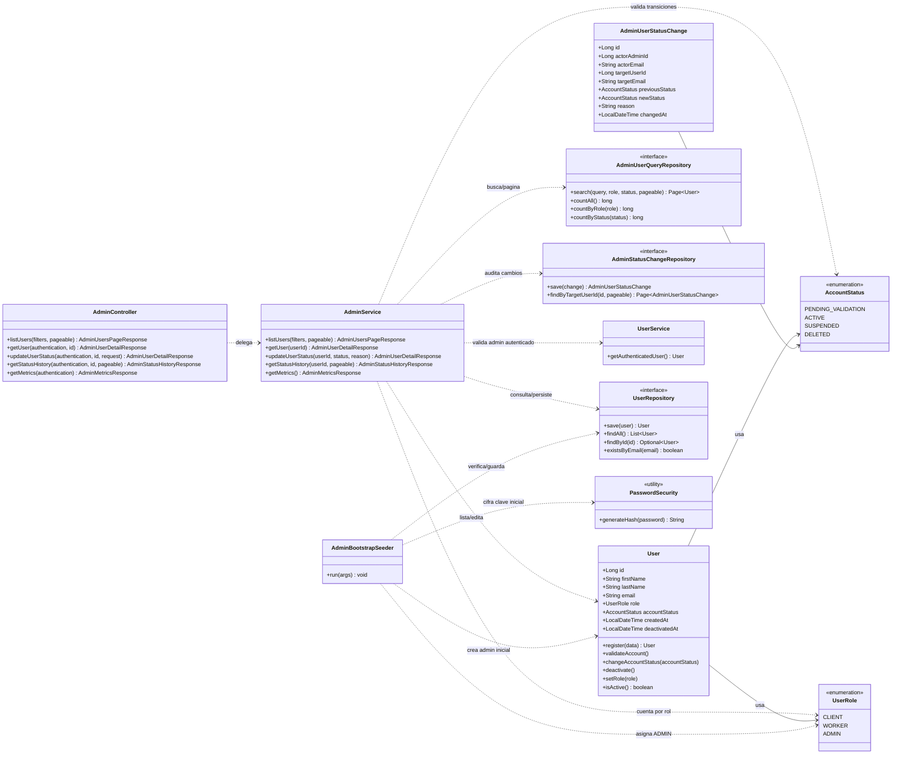

## Diagrama de clases propuesto para M03 `search`

M03 todavía no está implementado. El siguiente diseño propone separar los criterios de búsqueda, la consulta optimizada y el cálculo de ranking, reutilizando el perfil del trabajador de M02. `ServiceOffering`, `ServiceCategory` y `GeoLocation` deberán ajustarse cuando se definan sus catálogos y contratos definitivos.

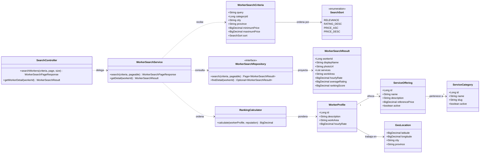

## Diagrama de clases propuesto para M04 `contracts`

M04 todavía no está implementado. El modelo propuesto concentra el ciclo de vida de la contratación en `ServiceContract` y publica eventos internos para que chat, historial, notificaciones, calificaciones y pagos reaccionen sin acoplar sus tablas.

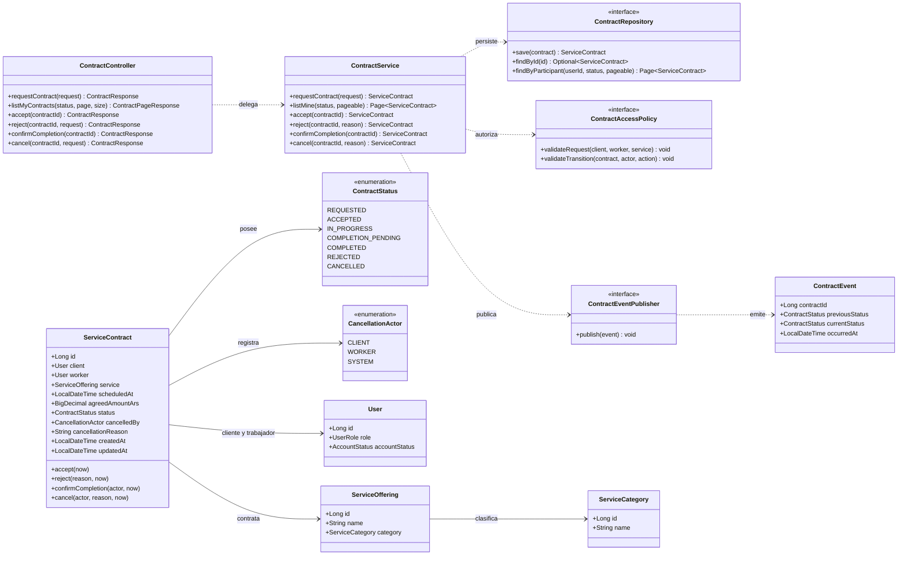

## Diagrama de clases del módulo `chat` (M05)

M05 cuenta con una implementación inicial independiente de M04. El contrato `ChatAccessPolicy` permite reemplazar la regla actual entre cliente y trabajador por una validación basada en contrataciones cuando M04 esté disponible.

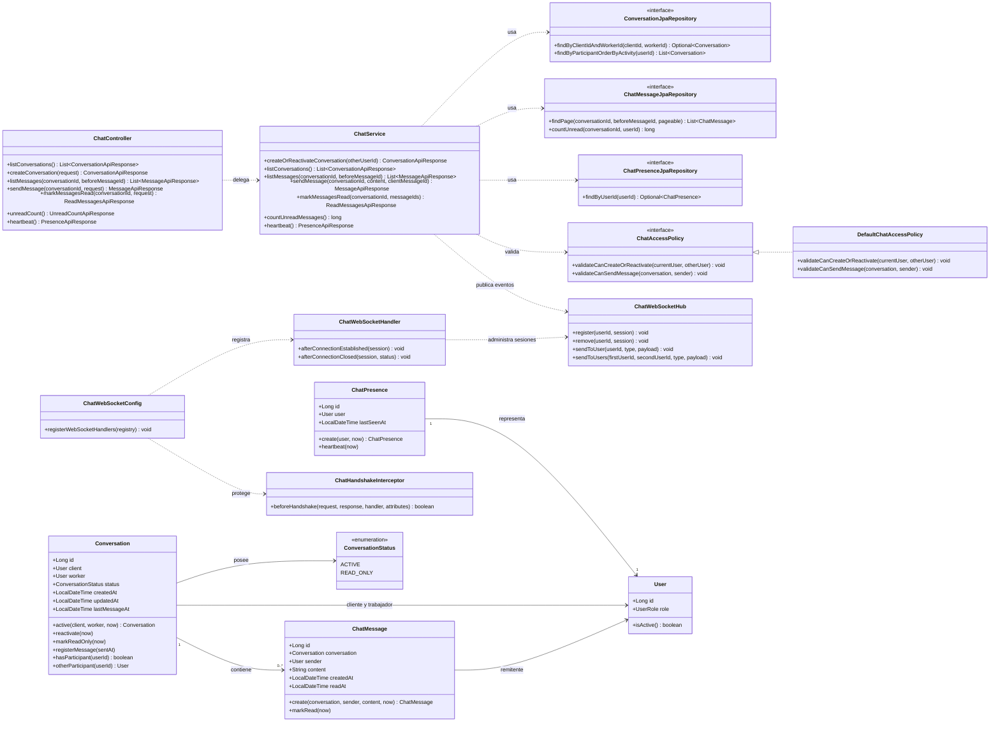

## Diagrama de clases propuesto para M07 `ratings`

M07 todavía no está implementado. La propuesta garantiza una sola calificación por contratación y por autor, conserva el comentario original y actualiza una proyección de reputación sin guardar el promedio dentro de `User`.

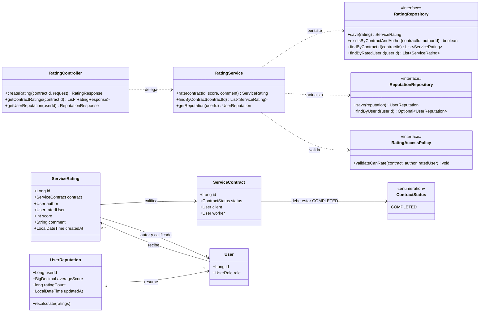

## Diagrama de clases de M08 `notifications`

M08 implementa un read model persistente separado del correo de autenticación de M01. El panel consulta las últimas 20 notificaciones y el contador total de pendientes; los cambios de lectura y las altas internas se propagan por un WebSocket dedicado. Los DTOs y adaptadores triviales se omiten para mantener legible el flujo principal.

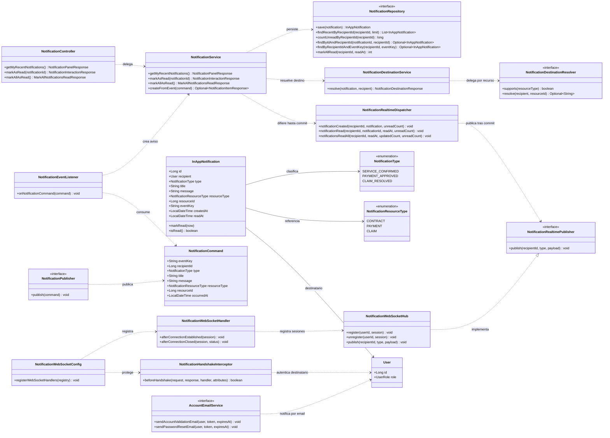

## Diagrama de clases propuesto para M09 `payments`

M09 todavía no está implementado. El diseño separa checkout, recepción idempotente de webhooks, reembolsos, sanciones y liquidaciones. Los estados de Mercado Pago deberán traducirse a enumeraciones propias antes de persistirse.

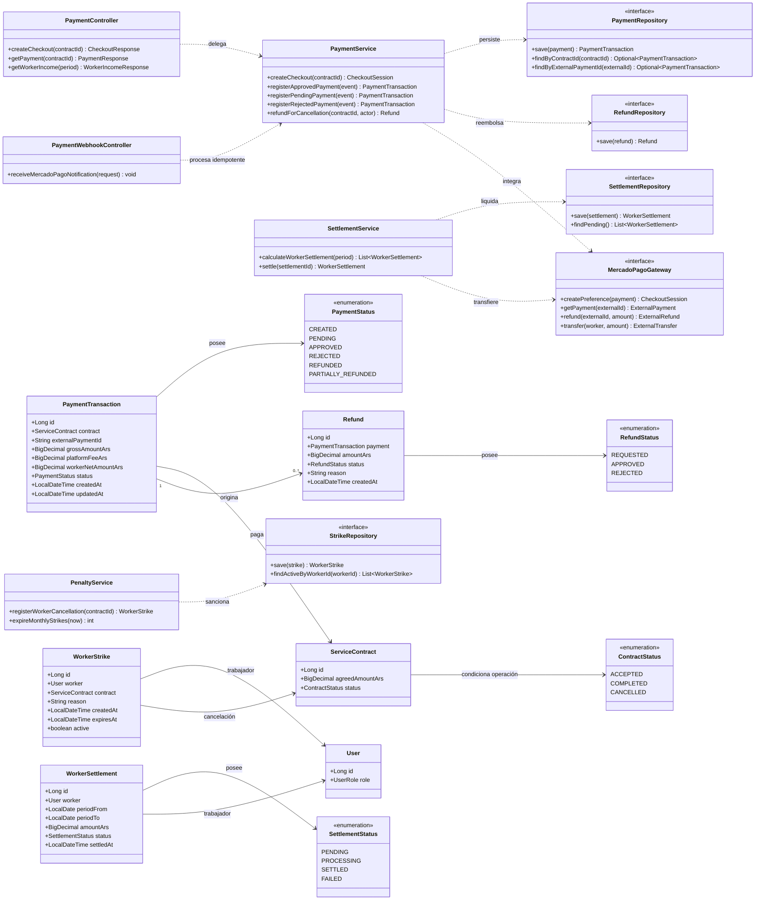

## Diagrama de clases propuesto para M10 `geolocation`

M10 todavía no está implementado. La propuesta usa una entidad de ubicación reutilizable y un valor `GeoPoint`; el perfil y la contratación conservan la referencia que corresponda sin depender de una biblioteca de mapas específica.

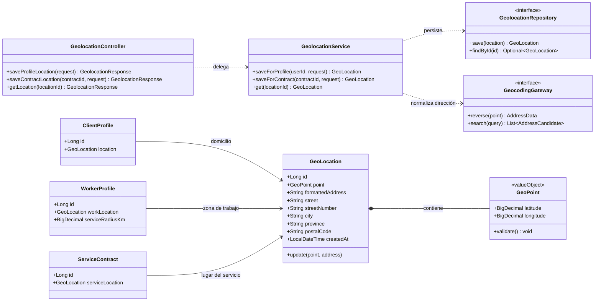

## Diagrama de clases propuesto para M11 `claims`

M11 todavía no está implementado. El diseño vincula cada reclamo con una contratación, conserva evidencias y una resolución auditable, y separa las acciones del usuario de la gestión administrativa.

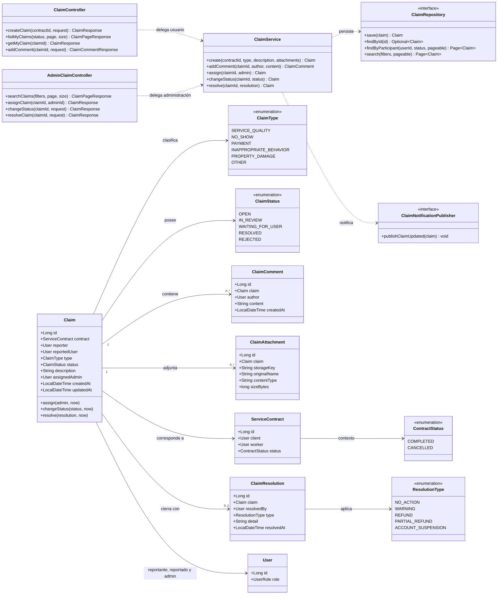
